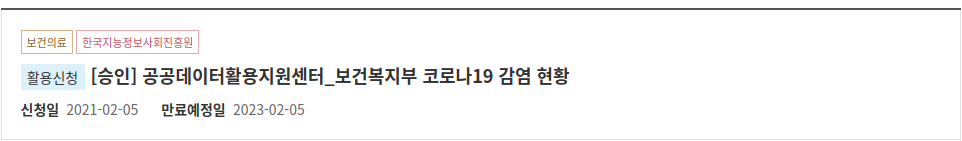
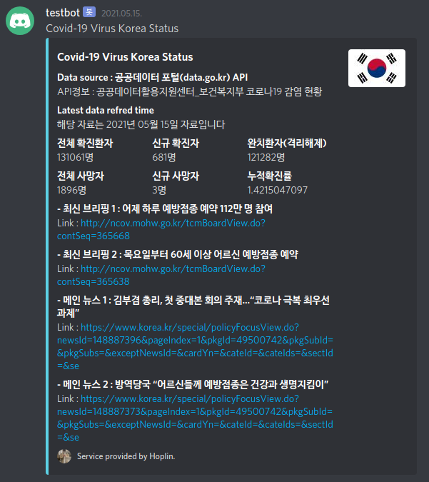
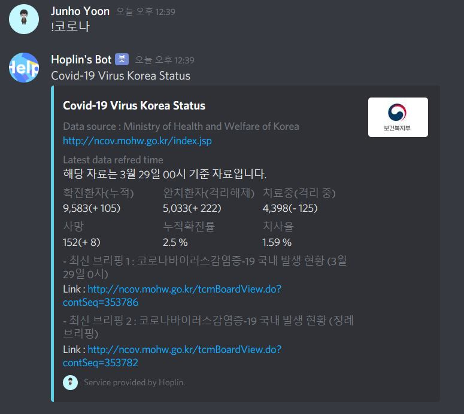

Discord Bot : Covid19 Korea Status Information bot
===

***
1 . Discord.py Version : 1.0.0(Rewrite Version)

2 . Language : Python3

3 . What for? : To make able to see Covid-19 Korea's Situation with command

4 . Datasource
    - Web Scraping Version : [Ministry of Health and Welfare of Korea](http://ncov.mohw.go.kr/index.jsp)
    - API using Version : [Korea Public Data Protal](https://www.data.go.kr/index.do)

5 . Web Scraping Version은 보건복지부 사이트 구조 변동에 의해 버그가 수시로 일어날 가능성이 있습니다. [API를 이용하여 만든 버전 사용](https://github.com/J-hoplin1/Covid19-Information-bot/tree/master/Using%20Public%20API)을 적극 권장드립니다
***

### Open API버전을 사용하는 방법

* Default : Discord API Key를 bottoken변수에 넣어주시기 바랍니다.

* 저는 기본적인 인터페이스 제공 및 원리를 보여드리기위해 위해 메소드에 키를 넣었지만 실제 서비스를 하시는 경우 보안적인 측면을 고려하기 위해 환경변수에 저장하거나 yml파일 혹은 외부 DB서버로부터 불러오는 방법들을 추천드립니다

* 주의 : API에는 일일트래픽(하루에 API를 사용할 수 있는 최대 횟수)이라는것이 존재합니다. 절대 API를 남용하지 마시기를 바랍니다.

1. [공공데이터](https://www.data.go.kr/index.do) 포털 회원가입 후 로그인

2. 이 코로나 봇에서는 '공공데이터활용지원센터_보건복지부 코로나19 감염 현황' API를 활용하였습니다.

    

3. 인증키를 받고 활용신청을 합니다.

4. 활용신청이 승인 되면, 자신의 공공데이터 API키를 CovidData.py init메소드의 apikey변수에 넣어주시기 바랍니다. 여기서 API키를 넣을때는 일반인증키(Decoding)을 넣어 주서야 합니다

5. 결과
    
    

### Web Scraping 버전을 사용하는 방법

- Discord API키를 넣어주시기만 하면 됩니다.

    

    
